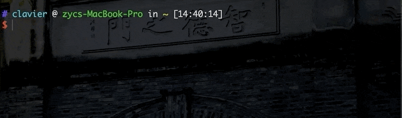
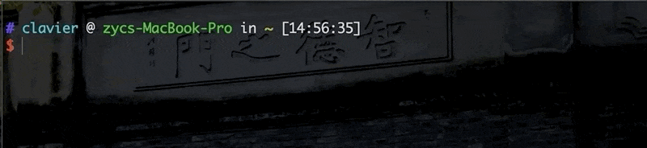
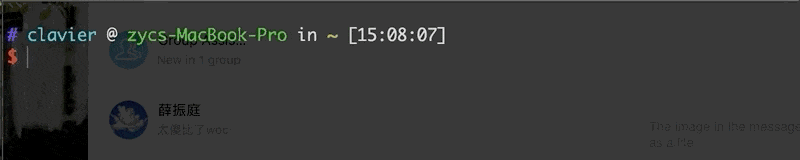
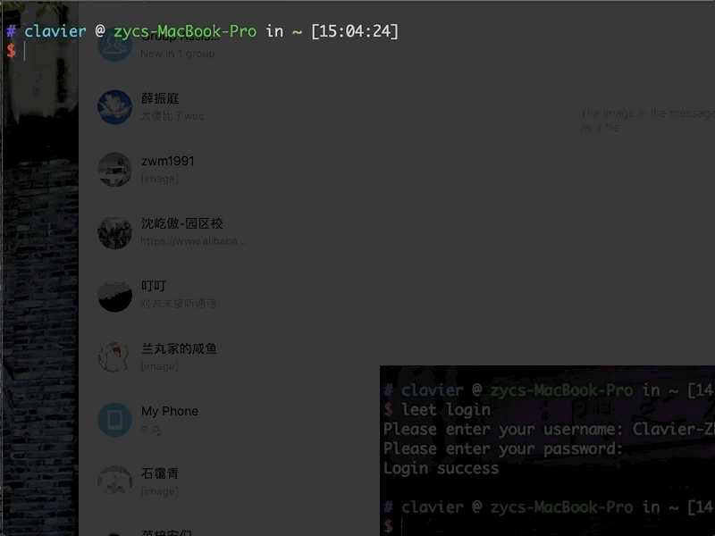
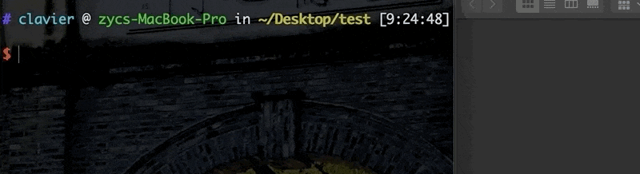
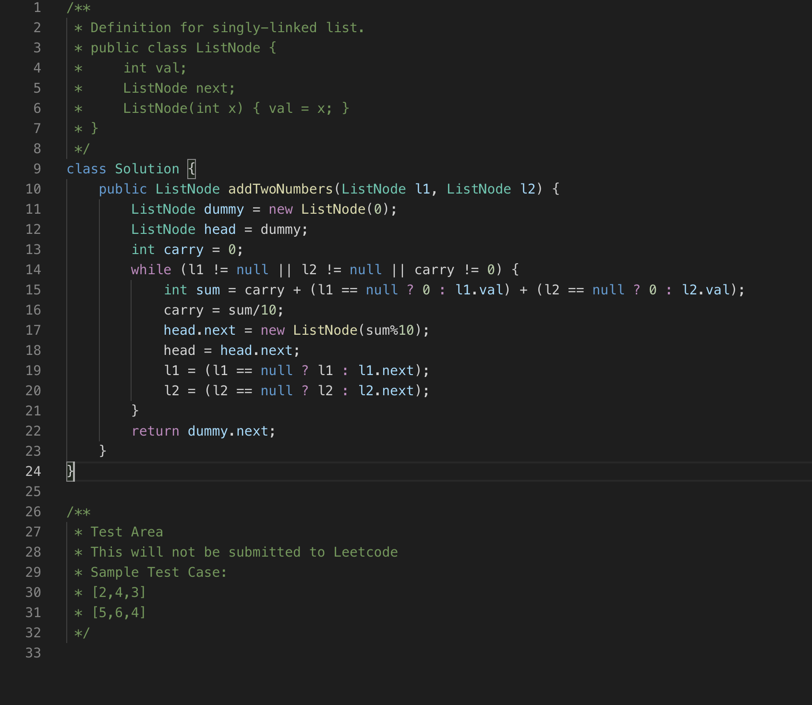
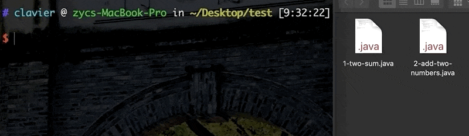
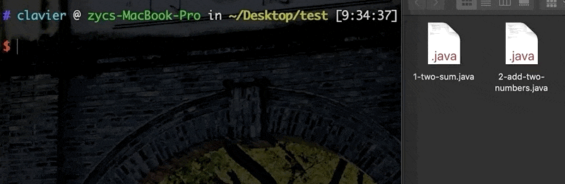
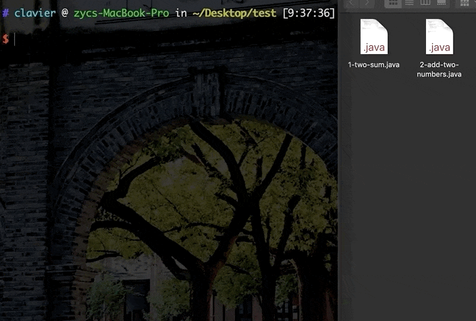
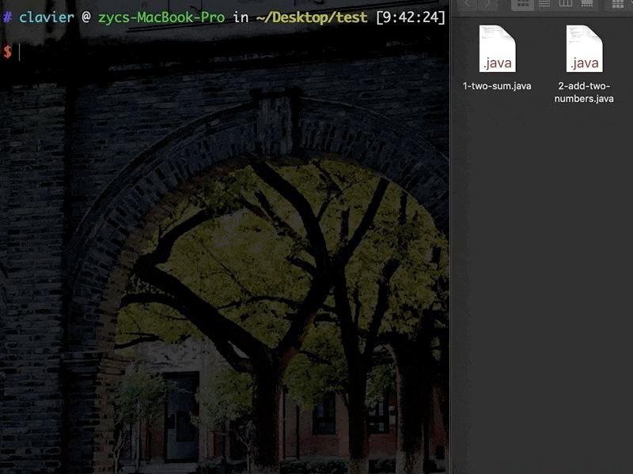

[](https://github.com/Clavier-Zhang/pyleetcode/blob/master/LICENSE)
# pyleetcode

LeetCode in Command Line!!!

Fight with LeetCode Questions at any time, any places

## Installation

From pip3
```sh
pip3 install pyleetcode
```

Or git clone, cd to the directory
```sh
pip3 install --editable .
```

## Quick Start

### Login
```sh
leet login
```


### Logout
```sh
leet logout
```


### Set Coding Language
```sh
leet lang [language]
language options: java, cpp, python, python3, c, csharp, javascript, ruby, swift, golang, scala, kotlin, rust, php
```


### Show Question List
```sh
leet show [start] [end]
```


### Show Question Detail
```sh
leet detail [question id]
```


### Generate code templates
```sh
leet start [question id]
```


### How to write testcase
Modify the testcase in the test area in the generated template


### Test
```sh
leet start [filename]
filename : must generated by <leet start command>
```


### Submit
```sh
leet submit [filename]
filename : must generated by <leet start command>
```


### Show Discussion Titles
Show the top 20 voted discussion titles
```sh
leet diss [question id]
```


### Show Discussion Detail
Show the detail of a discussion post
```sh
leet diss [question id] [rank]
```


