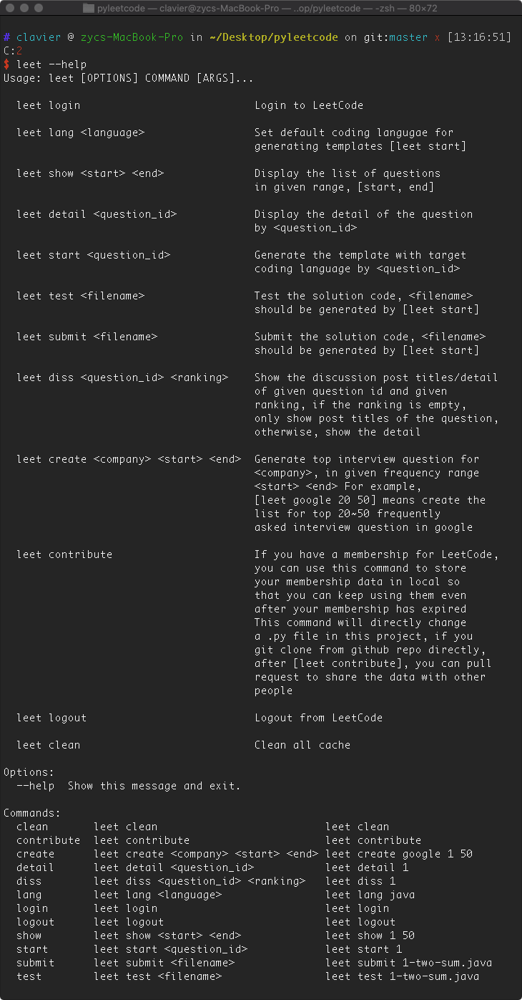

<br />
<p align="center">
  <a href="https://github.com/Clavier-Zhang/AWSL-Japanese">
    
  </a>
  <h3 align="center">Pyleetcode</h3>
  <p align="center">
    LeetCode in Command Line!!!
    <br />
  </p>
  
  </p>
</p>

<p align="center">
    *IMPORTANT* LeetCode enhanced their API security at Nov 2019 (something from Google). Currently, only Chinese Leetcode accounts can use this tool.
</p>

## Table of Contents

- [Table of Contents](#table-of-contents)
- [Getting Started](#getting-started)
- [Commands Usage](#commands-usage)
  - [Settings](#settings)
  - [Solve Problems](#solve-problems)
  - [Contribute](#contribute)
- [Examples](#examples)
  - [Auth](#auth)
  - [Set Coding Language](#set-coding-language)
  - [Show Question List](#show-question-list)
  - [Show Question Detail](#show-question-detail)
  - [Generate code templates](#generate-code-templates)
  - [How to write testcase](#how-to-write-testcase)
  - [Test](#test)
  - [Submit](#submit)
  - [Show Discussion Titles](#show-discussion-titles)
  - [Show Discussion Detail](#show-discussion-detail)


## Getting Started

From pip
```sh
pip install pyleetcode
```

From github

```sh
git clone https://github.com/Clavier-Zhang/pyleetcode.git
cd pyleetcode
pip install --editable .
```


## Commands Usage
<!--  -->

### Settings
```console
    leet login                           Login to LeetCode

    leet lang <language>                 Set default coding langugae for 
                                         generating templates [leet start]

    leet logout                          Logout from LeetCode
      
    leet clean                           Clean all cache
```

### Solve Problems
```console
    leet show <start> <end>              Display the list of questions 
                                         in given range, [start, end]
      
    leet detail <question_id>            Display the detail of the question 
                                         by <question_id>
      
    leet start <question_id>             Generate the template with target 
                                         coding language by <question_id>
      
    leet test <filename>                 Test the solution code, <filename> 
                                         should be generated by [leet start]
      
    leet submit <filename>               Submit the solution code, <filename> 
                                         should be generated by [leet start]
      
    leet diss <question_id> <ranking>    Show the discussion post titles/detail 
                                         of given question id and given 
                                         ranking, if the ranking is empty, 
                                         only show post titles of the question, 
                                         otherwise, show the detail
      
    leet create <company> <start> <end>  Generate top interview question for 
                                         <company>, in given frequency range 
                                         <start> <end> For example, 
                                         [leet google 20 50] means create the 
                                         list for top 20~50 frequently 
                                         asked interview question in google
```

### Contribute
```console
    leet contribute                      If you have a membership for LeetCode, 
                                         you can use this command to store 
                                         your membership data in local so 
                                         that you can keep using them even 
                                         after your membership has expired
                                         This command will directly change 
                                         a .py file in this project, if you 
                                         git clone from github repo directly, 
                                         after [leet contribute], you can pull 
                                         request to share the data with other 
                                         people
```


## Examples

### Auth
```sh
leet login
leet logout
```


### Set Coding Language
```sh
leet lang [language]
language options: java, cpp, python, python3, c, csharp, javascript, ruby, swift, golang, scala, kotlin, rust, php
```


### Show Question List
```sh
leet show [start] [end]
```


### Show Question Detail
```sh
leet detail [question id]
```


### Generate code templates
```sh
leet start [question id]
```


### How to write testcase
Modify the testcase in the test area in the generated template


### Test
```sh
leet start [filename]
filename : must generated by <leet start command>
```


### Submit
```sh
leet submit [filename]
filename : must generated by <leet start command>
```


### Show Discussion Titles
Show the top 20 voted discussion titles
```sh
leet diss [question id]
```


### Show Discussion Detail
Show the detail of a discussion post
```sh
leet diss [question id] [rank]
```


